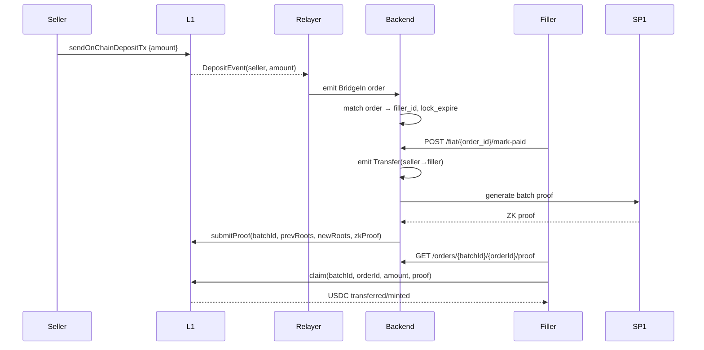

# Vapor - P2P Offramp (PYUSD↔USD) MVP

## Executive Summary

Vapor is a P2P USD offramp focused on USDC/PYUSD ↔ USD built for the hackathon with a minimal trust-minimized architecture. We combine off-chain order matching and batching with on-chain ZK proof verification to create a scalable, privacy-preserving offramp solution.

### Key Features
- **On-chain**: Minimal ProofVerifierRegistry for batch-pinned roots and ZK proof verification
- **Off-chain**: Order matching, account state management, SP1 ZK proof generation
- **MVP Flow**: Bridge in → Order matching → Fiat confirmation → ZK proof → On-chain claim

## Problem Statement

Current off-ramps are fragmented and opaque. Vapor provides:
- ✅ Scalable off-chain performance (matching, batching, account trees)
- ✅ Privacy preservation (account states not exposed publicly)
- ✅ Verifiable batch outcomes via ZK proofs
- ✅ Minimal on-chain footprint
- ✅ Clean integration path for future ZK fiat attestations

## Architecture Overview

### On-Chain Components

#### ProofVerifierRegistry Contract
```solidity
// Core functions
function submitProof(
    uint256 batchId,
    uint256 prevBatchId,
    bytes32 prevStateRoot,
    bytes32 prevOrdersRoot,
    bytes32 newStateRoot,
    bytes32 newOrdersRoot,
    bytes calldata proof
) external;

function claim(
    uint256 batchId,
    uint256 orderId,
    address to,
    uint256 amount,
    bytes32[] calldata proofPath
) external;
```

### Off-Chain Components

#### Order Types
- **BridgeIn**: Credit seller on deposit
- **Transfer**: Move funds seller→filler when fiat confirmed
- **BridgeOut**: Debit filler balance, create withdrawal claim

#### SP1 Guest Program
Validates batch transitions and enforces:
- Balance invariants (non-negativity, conservation)
- Lock semantics and timeouts
- Merkle tree updates
- Fiat confirmation rules

## Data Flow



## State Model

### State Tree (Private Off-chain)
- **Leaf**: `L_acc = H(addr, usdc_balance)`
- **Root**: Committed on-chain per batch (balances remain private)

### Orders Tree (Private Off-chain)
- **Leaf**: `L_order = keccak256(abi.encode(batchId, orderId, kind, from, to, tokenId, amount))`
- **Kind**: 0=BridgeIn, 1=BridgeOut, 2=Transfer
- **Claims**: Only valid for kind=1 (BridgeOut) leaves

### Batch Structure
```json
{
  "prevStateRoot": "0x...",
  "prevOrderBookRoot": "0x...",
  "orders": [],
  "newStateRoot": "0x...",
  "newOrderBookRoot": "0x..."
}
```

## API Reference

### REST Endpoints

#### Order Management
```http
POST /order/sell
Content-Type: application/json

{
  "amount": "100.00",
  "seller_address": "0x..."
}
```

#### Fiat Confirmation (MVP Simplified)
```http
POST /fiat/{orderId}/mark-paid
```

#### Batch Operations
```http
POST /batch/prove-and-submit
```

#### Proof Service
```http
GET /orders/{batchId}/{orderId}/proof
```

## Quick Start

### Prerequisites
- Rust (latest stable)
- Node.js 18+
- Foundry
- Docker (optional)

### Setup

1. **Clone and install dependencies**
```bash
git clone https://github.com/BrianSeong99/Cashlink
cd Cashlink
cargo build --release
npm install
```

2. **Deploy contracts**
```bash
cd contracts
forge build
forge script script/Deploy.s.sol --rpc-url <RPC_URL> --broadcast
```

3. **Start the backend**
```bash
cargo run --bin cashlink-server
```

4. **Run demo flow**
```bash
./scripts/happy_path.sh
```

### Demo Scripts

#### Seed Initial State
```bash
./scripts/seed.sh
# Seeds seller with USDC and sets up initial balances
```

#### Happy Path Demo
```bash
./scripts/happy_path.sh
# Runs complete flow: deposit → match → mark paid → batch → claim
```

## Development Workflow

### Local Development
1. Start local anvil chain: `anvil`
2. Deploy contracts: `forge script script/Deploy.s.sol --rpc-url http://localhost:8545 --broadcast`
3. Start backend: `cargo run --bin cashlink-server`
4. Run tests: `cargo test`

### Testing
```bash
# Unit tests
cargo test

# Integration tests
cargo test --test integration

# Contract tests
forge test
```

## Configuration

### Environment Variables
```env
# Blockchain
RPC_URL=http://localhost:8545
PRIVATE_KEY=0x...
CONTRACT_ADDRESS=0x...

# SP1
SP1_PROVER=network  # or "local"
SP1_PRIVATE_KEY=...

# API
PORT=8080
DATABASE_URL=sqlite:cashlink.db
```

### Config File (`config.toml`)
```toml
[blockchain]
rpc_url = "http://localhost:8545"
contract_address = "0x..."

[sp1]
prover = "network"
program_id = "0x..."

[api]
host = "0.0.0.0"
port = 8080

[batch]
interval_seconds = 60
max_orders_per_batch = 100
```

## Security Considerations

### MVP Limitations
- ⚠️ Fiat confirmation uses backend "Mark Paid" (not ZK-verified)
- ⚠️ Bank integration stubbed for hackathon
- ⚠️ Single operator model (not decentralized)

### Production Roadmap
- [ ] ZK-verified fiat settlements
- [ ] Decentralized operator network
- [ ] Multi-asset support
- [ ] Advanced matching algorithms

## Acceptance Criteria

- ✅ Seller deposit triggers BridgeIn order with State Tree update
- ✅ Lock + Mark Paid produces Transfer order with SP1 validation
- ✅ Batch proving posts both stateRoot and ordersRoot via submitProof
- ✅ Filler can fetch Merkle proof and claim BridgeOut successfully
- ✅ Double-claim prevention via spent[orderId] nullifier

## Project Structure

```
Cashlink/
├── src/
│   ├── main.rs              # Server entry point
│   ├── api/                 # REST API handlers
│   ├── orders/              # Order management
│   ├── matching/            # Order matching engine
│   ├── batch/               # Batch processing
│   ├── sp1/                 # ZK proof generation
│   └── merkle/              # Merkle tree operations
├── contracts/
│   ├── src/
│   │   └── ProofVerifierRegistry.sol
│   └── script/
│       └── Deploy.s.sol
├── scripts/
│   ├── seed.sh
│   └── happy_path.sh
└── tests/
    ├── integration/
    └── unit/
```

## Contributing

This is a hackathon MVP focused on demonstrating core functionality. For production development:

1. Fork the repository
2. Create feature branch
3. Add tests for new functionality
4. Submit pull request with detailed description

## License

MIT License - see LICENSE file for details

---

**Built for EthNYC - Demonstrating the future of trust-minimized P2P offramps**