# Vapor - Private, Permissionless OffRamp

## Executive Summary

Vapor is a privacy-first P2P offramp system that enables users to convert PYUSD tokens to real-world fiat payments through a decentralized network of fillers. Built with a mobile-first approach, Vapor provides a seamless bridge between DeFi and traditional finance.

### Key Features
- **🔐 Private**: Order details remain confidential until matched
- **⚡ Fast**: Real-time order matching and status updates
- **📱 Mobile-First**: Responsive UI optimized for mobile devices
- **🤝 P2P**: Direct filler-to-user payments via PayPal, Wise, Bank transfers
- **🔄 Automated**: Auto-discovery and batch processing systems

## Problem Statement

Current crypto off-ramps are:
- **Centralized**: Single points of failure and control
- **Expensive**: High fees and poor exchange rates
- **Slow**: Multi-day settlement times
- **Privacy-Poor**: Full transaction history exposed

Vapor solves this with:
- ✅ **Decentralized P2P matching**: No central authority
- ✅ **Competitive rates**: Direct filler competition
- ✅ **Instant settlements**: Real-time fiat payments
- ✅ **Privacy-preserving**: Order details hidden until matched

## Architecture Overview

### Frontend (Next.js)
- **Mobile-First Design**: Responsive UI optimized for touch devices
- **Wallet Integration**: Privy for seamless wallet connections
- **Real-Time Updates**: 5-second polling for order status
- **Multi-Flow Support**: Separate interfaces for sellers and fillers

### Backend (Rust/Axum)
- **REST API**: Comprehensive endpoints for orders, fillers, batches
- **Order Management**: Complete lifecycle from creation to settlement
- **Auto-Discovery**: Automated system to move orders to discovery phase
- **Batch Processing**: Merkle tree generation and proof creation
- **Matching Engine**: P2P order matching with filler selection

### Database (SQLite)
- **Orders Table**: Order details, status, filler assignments
- **Fillers Table**: Filler balances, wallets, locked amounts
- **Batches Table**: Batch data, state roots, proof information

### Blockchain Integration
- **Local Anvil Node**: Development blockchain environment
- **Smart Contracts**: Bridge contract, Proof verifier, USDC token
- **PYUSD Support**: Full integration with PayPal USD token


## User Flow

```mermaid
sequenceDiagram
    participant User as 👤 User
    participant App as 🖥️ Vapor App
    participant API as ⚙️ Backend
    participant DB as 📊 Database
    participant Filler as 🤝 Filler
    participant Bank as 💰 Bank/PayPal
    
    Note over User,Bank: Simple Vapor Off-Ramp Flow
    
    %% Step 1: Create Order
    User->>App: I want to cash out $1000 PYUSD
    App->>User: Connect your wallet
    User->>App: ✅ Wallet connected
    App->>API: Create withdrawal order
    API->>DB: Save order (Pending)
    API-->>App: Order created
    App->>User: Order submitted! 📝
    
    %% Step 2: Find Filler
    Note over API,Filler: Auto-matching system
    API->>DB: Move to Discovery
    Filler->>API: Check for orders
    API-->>Filler: Here's a $1000 order
    Filler->>API: I'll take it!
    API->>DB: Lock order for filler
    
    %% Step 3: Payment
    Filler->>Bank: Send $1000 to user's PayPal
    Bank-->>User: 💰 You received $1000!
    Filler->>API: Payment sent, here's proof
    API->>DB: Mark as paid
    
    %% Step 4: Completion
    User->>App: Yes, I got the money! ✅
    App->>API: Confirm receipt
    API->>DB: Order complete
    API->>Filler: Release your PYUSD tokens
    
    Note over User,Bank: Done! PYUSD → Real Money 🎉
```



## Order Lifecycle

### Order States
1. **Pending** → Order created, waiting for blockchain confirmation
2. **Discovery** → Available for fillers to view and lock
3. **Locked** → Filler has committed to fulfill the order
4. **MarkPaid** → Filler has submitted payment proof
5. **Settled** → Order complete, funds released

### Order Types
- **BridgeIn**: User deposits PYUSD, wants fiat
- **Transfer**: Internal transfer between accounts (seller → filler)
- **BridgeOut**: Filler withdraws tokens after providing fiat

### Auto-Discovery Process
- Runs every 5 seconds
- Moves `Pending` BridgeIn orders to `Discovery` status
- Excludes Transfer orders (handled by batch processor)

## API Reference

### Order Management
```http
# Create new order
POST /api/v1/orders
Content-Type: application/json
{
  "order_type": "BridgeIn",
  "from_address": "0x...",
  "to_address": "0x...",
  "token_id": 2,
  "amount": "1000",
  "bank_account": "841273-1283712",
  "bank_service": "PayPal Hong Kong",
  "banking_hash": "0x..."
}

# Get order status
GET /api/v1/orders/{order_id}/status

# List orders
GET /api/v1/orders?status=discovery&limit=10
```

### Filler Operations
```http
# Get available orders
GET /api/v1/fillers/discovery

# Lock order
POST /api/v1/fillers/orders/{order_id}/lock
{
  "filler_id": "filler-123",
  "amount": "1000"
}

# Submit payment proof
POST /api/v1/fillers/orders/{order_id}/payment-proof
{
  "banking_hash": "0x..."
}

# Get filler balance
GET /api/v1/fillers/{filler_id}/balance
```

### Batch Processing
```http
# Start new batch
POST /api/v1/batch/start

# Finalize batch
POST /api/v1/batch/finalize

# Get batch stats
GET /api/v1/batch/stats
```

## Quick Start

### Prerequisites
- Rust (latest stable)
- Node.js 18+
- Foundry
- Git

### Setup

1. **Clone the repository**
```bash
git clone https://github.com/your-org/Chainless
cd Chainless/Vapor
```

2. **Start the blockchain (Terminal 1)**
```bash
cd contracts
anvil
```

3. **Deploy contracts (Terminal 2)**
```bash
cd contracts
forge build
forge script script/Deploy.s.sol --rpc-url http://localhost:8545 --broadcast --private-key 0xac0974bec39a17e36ba4a6b4d238ff944bacb478cbed5efcae784d7bf4f2ff80
```

4. **Start the backend (Terminal 3)**
```bash
cd backend
cargo run
```

5. **Start the frontend (Terminal 4)**
```bash
cd frontend
npm install
npm run dev
```

6. **Access the application**
- Frontend: http://localhost:8080
- Backend API: http://localhost:3000

### Demo Flow

1. **Fund your wallet with PYUSD**
   - Use the navigation panel's "Fund" button
   - Or manually send PYUSD to your wallet address

2. **Create a withdrawal order**
   - Enter amount and bank details
   - Connect wallet and approve transaction
   - Confirm the deposit

3. **Monitor order status**
   - Watch the 4-step progress tracker
   - Status updates every 5 seconds

4. **Filler interface**
   - Navigate to `/filler` to see available orders
   - Lock and fulfill orders as a filler

## Development

### Project Structure
```
Vapor/
├── frontend/          # Next.js React app
├── backend/           # Rust Axum API server
├── contracts/         # Solidity smart contracts
└── scripts/          # Deployment and utility scripts
```

### Key Technologies
- **Frontend**: Next.js 15, React 19, Privy, Wagmi, Tailwind CSS
- **Backend**: Rust, Axum, SQLite, Tokio
- **Blockchain**: Foundry, Anvil, Solidity
- **Database**: SQLite with migrations

## Configuration

### Backend Configuration
The backend uses environment variables and a SQLite database:

```env
# Default settings
PORT=3000
DATABASE_URL=sqlite:vapor_dev.db
RUST_LOG=info
```

### Frontend Configuration
```env
# Next.js settings
PORT=8080
NEXT_PUBLIC_API_URL=http://localhost:3000
```

### Smart Contract Addresses
```env
# Local Anvil deployment
BRIDGE_CONTRACT=0xCf7Ed3AccA5a467e9e704C703E8D87F634fB0Fc9
PROOF_VERIFIER=0x9fe46736679d2d9a65f0992f2272de9f3c7fa6e0
USDC_TOKEN=0x5fbdb2315678afecb367f032d93f642f64180aa3
```

## Features

### ✅ Current Implementation
- **Order Creation**: Complete PYUSD deposit and order creation flow
- **Auto-Discovery**: Automated order progression (Pending → Discovery)
- **Filler Matching**: P2P order locking and fulfillment
- **Status Tracking**: Real-time progress updates with 4-step UI
- **Payment Processing**: Filler payment proof submission
- **Batch Processing**: Merkle tree generation and state management
- **Mobile UI**: Responsive design optimized for mobile devices
- **Wallet Integration**: Privy wallet with PYUSD support

### 🚧 Future Enhancements
- [ ] ZK proof verification for fiat settlements
- [ ] Multi-asset support (USDC, other stablecoins)
- [ ] Advanced matching algorithms with price discovery
- [ ] Decentralized filler network
- [ ] Cross-chain support
- [ ] Enhanced privacy features

## Contributing

This project demonstrates a privacy-first P2P offramp system. To contribute:

1. Fork the repository
2. Create a feature branch (`git checkout -b feature/amazing-feature`)
3. Make your changes and add tests
4. Commit your changes (`git commit -m 'Add amazing feature'`)
5. Push to the branch (`git push origin feature/amazing-feature`)
6. Open a Pull Request

## License

MIT License - see LICENSE file for details

---

**🌊 Vapor - Turn your crypto into cash, privately and instantly**

*Built with ❤️ for the future of decentralized finance*